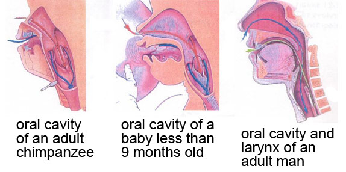
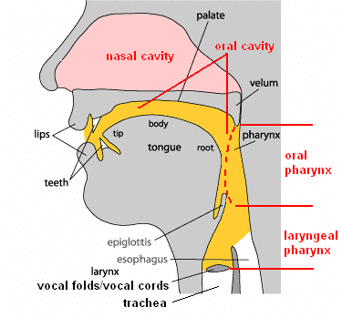
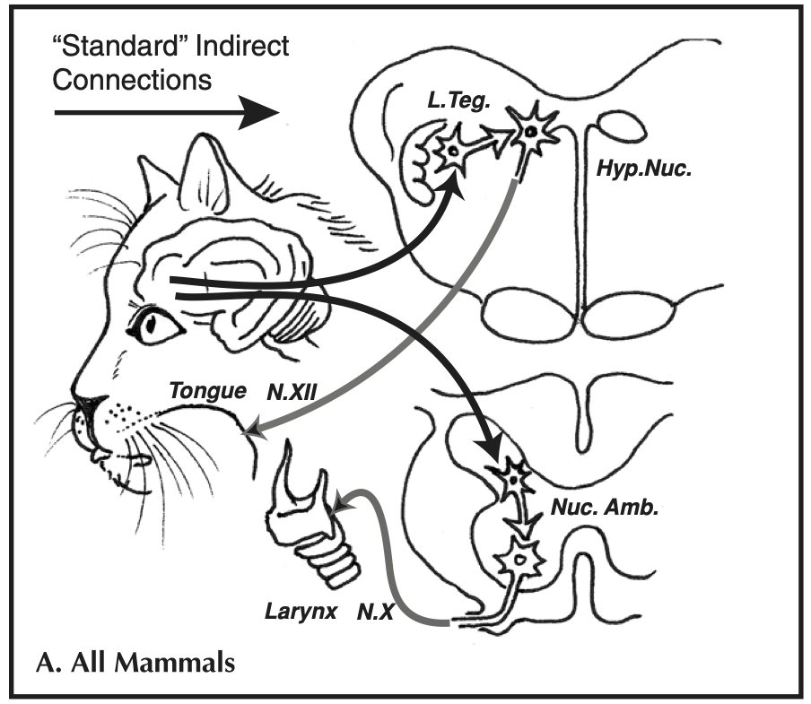
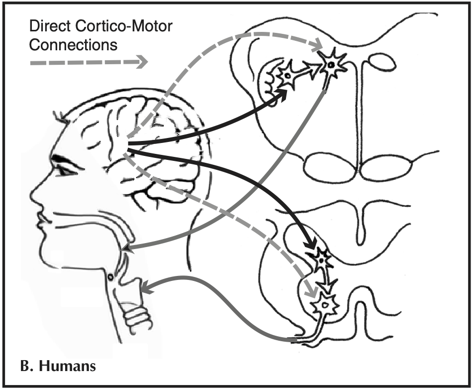

*As usual, read this blog, read the paper, and then take the quiz on Learn to test your understanding.*

This week, after reading this intro blog, you will read [Tyack (2019)](http://dx.doi.org/10.1098/rstb.2018.0406). The theme for this week is the learning of speech and grammar. The lecture will focus on the comparative psychology of grammar learning (which might give us some insights into the evolution of the human capacities in that domain): the reading provides relevant background information on vocal learning (as involved in learning speech in humans). In this blog post I'll deal with some preliminaries on the evolution of the vocal tract, and some background on vocal learning that sets the scene for the Tyack reading.

## The evolution of the vocal tract

One relatively early idea in the language evolution literature was that the human vocal tract may have evolved to allow us to produce complex comprehensible speech, speech being the default (but not the only) modality for language. An early focus in this literature was on the position of the larynx in the human vocal tract, which was (for a time) believed to be unusual in humans in occupying a low resting position, giving us a two-chamber vocal tract that (possibly) increases the range of contrastive vowel sounds that can be produced. 

Most animals, and very young humans, have a larynx that is positioned high in the throat, which allows them to engage the larynx directly with the velum, forming a nice tight seal which prevents food/liquid being inhaled. In many other animals, and young human infants, the larynx engages with the velum and nasal cavity, making it possible to breathe through the nose (red arrows) while swallowing (blue arrows). 

  \
*Image from http://thebrain.mcgill.ca/flash/capsules/outil_bleu21.html.)*

The resting position of the adult human larynx is lower in the throat, and too far down to allow the larynx to engage with the velum in this way. 

The larynx moves to its lower position early in development (around age 3 months), with a second descent to an even lower position occurring during puberty in males only (which turns out to be informative about possible evolutionary functions for the low position of the larynx in humans, see below). This low larynx position increases (at least hypothetically) the risk of choking -- every time you swallow, the stuff you are swallowing has to pass over the top of your windpipe and into the oesophagus, the epiglottis pulls down over the opening to the windpipe to cover the opening, as shown quite nicely in [this animation](https://www.youtube.com/watch?v=UNwXoW7z24E).

<!-- [embed]https://www.youtube.com/embed/UNwXoW7z24E?si=lr_-0tb3Isui2eSx[/embed] -->
<iframe width="560" height="315" src="https://www.youtube.com/embed/UNwXoW7z24E?si=lr_-0tb3Isui2eSx" title="YouTube video player" frameborder="0" allow="accelerometer; autoplay; clipboard-write; encrypted-media; gyroscope; picture-in-picture; web-share" referrerpolicy="strict-origin-when-cross-origin" allowfullscreen></iframe>

It has long been thought that the risks of the descended larynx -- the danger of choking on food or liquid -- must be outweighed by some advantage, perhaps related to language?

  \
*Annotated diagram of the adult human vocal tract - useful for terminology. From [https://www.researchgate.net/figure/Anatomical-structure-of-human-vocal-system-Adapted-from-How-language-works-Indiana_fig3_259333765](https://www.researchgate.net/figure/Anatomical-structure-of-human-vocal-system-Adapted-from-How-language-works-Indiana_fig3_259333765)*

One possibility is that the lower position of the larynx also drags the tongue root down into the pharynx, which gives us a two-tube vocal tract: we can manipulate the size of the oral cavity with the tongue tip, and independently manipulate the pharyngeal tube by pushing the tongue backwards and forwards -- this is really nicely illustrated in [the MRI images on this page, under section 2 "Vowel Articulation"](http://www.phon.ucl.ac.uk/courses/spsci/iss/week5.php). The idea is that this two-chamber vocal tract gives access to a wider range of formant frequencies, boosting the range of distinctive speech sounds we can produce.

However, demonstrated convincingly in a series of papers by Tecumseh Fitch (for review see Chapter 8 of Fitch (2010), [available online via DiscoverEd](https://discovered.ed.ac.uk/permalink/44UOE_INST/7g3mt6/alma9922363073502466))), it turns out that the low position of the larynx/tongue root in humans isn't actually very unusual. Firstly, many other mammals (including e.g. dogs) can dynamically reconfigure their vocal tract during vocalisation -- they pull their larynx low in the throat while vocalising, giving them (temporarily) a two-tube vocal tract very similar in configuration to ours. Second, it turns out that many other species (e.g. koalas, big cats, deer) have a *permanent* low larynx position, giving them a two-tube vocal tract similar to humans - you can see the low resting position of the larynx (big lump in the throat), and also the fact that these animals pull it even lower when vocalising, in [this video of a vocalising red deer](https://www.youtube.com/watch?v=xJxfTyJNp_o) (courtesy of Tecumseh Fitch).

There are two consequences of this. Firstly, since many mammals can reconfigure their vocal tract while vocalising, previous attempts to figure out the position of the larynx/tongue root in fossil hominids are rather pointless - even if we were able to infer a high resting position, there would still be the possibility that the vocal tract was reconfigured during vocalisation. Second, since a (permanently or temporarily) descended larynx/tongue root is seen in species that don't have language or even complex vocalisations (e.g. deer, big cats -- they basically just roar, which I think we can all agree is pretty spectacular but not language), there must be some other pressure that explains the convergent evolution of the descended larynx in humans and these other species.

Fitch (2010) suggests that the most likely explanation for the descended larynx is **size exaggeration** -- the lower your larynx, the longer your vocal tract, and the bigger you sound. This can be 'faked' to a certain extent by pulling your larynx lower, but is intrinsically an honest signal -- you can't pull your larynx outside your body, so bigger individuals have longer vocal tracts and sound bigger. Size exaggeration might be useful in sexual displays, in male-male competition (think of the roaring red deer) or more generally in territory defence (both male and female big cats roar, and both have a permanently descended larynx that emphasises their size for anyone hearing it). In humans, the second descent of the larynx in puberty in males suggests a sexual signaling function; the descent of the larynx in both sexes at age 3 months is presumably driven by different pressures, applying to both sexes. The descended larynx may therefore give us a nice vocal tract for producing contrastive speech sounds, but needn't (initially) have been selected for this function. Instead, the descended larynx might be a **preadaptation** for speech: the reconfigured vocal tract was originally selected for due to fitness payoffs associated with size exaggeration, then subsequently re-tooled for the benefits it offered for complex speech.

More recent work, also by Fitch and colleagues ([Fitch et al., 2016](https://www.science.org/doi/10.1126/sciadv.1600723)), looks at the vocal tract more holistically, and demonstrates (again, convincingly to me) that in fact nothing about the vocal tracts of non-human primates would prevent them from producing a sufficiently large and distinguishable set of speech sounds to support a language. They did this by having macaques (a species of Old World monkeys, last common ancestor with humans something like 40 million years ago) vocalise, eat and generally move their vocal tract around in an x-ray machine, which allowed them to measure the range of movement and the positions that monkey vocal tract could adopt; they then fed those dimensions into a series of equations allowing them to calculate the formants that vocalising in each possible vocal tract configuration they observed. There is consirable overlap between the producable range of acoustics the monkey vocal tract can produce and those exploited in human language (or English, at least), meaning that they can actually synthesise understandable speech using a model macaque vocal tract: you can listen to synthesised [human](https://www.science.org/doi/suppl/10.1126/sciadv.1600723/suppl_file/audio_s1_humanwymm.wav) and [monkey](https://www.science.org/doi/suppl/10.1126/sciadv.1600723/suppl_file/audio_s2_monkeywymm.wav) speech, neither proposal sounds very enticing but both are quite clear. 

The overall picture on the human vocal tract is therefore that, sadly (?), humans aren't as special as we thought in our physical apparatus for speech production. We probably also aren't special in our auditory apparatus for speech perception (as also reviewed in Fitch 2010, chapter 8) - we have a standard mammal ear, and other mammals have been shown to exhibit e.g. categorical perception effects that were at one point assumed to be uniquely human. For instance, chinchillas trained in the lab to discriminate between /t/ and /d/ show the same sort of discrimination curve as adult humans. [The original paper showing this](http://www.ai.mit.edu/projects/dm/kuhl-chinchillas.pdf) is quite short, if a little stomach-churning in terms of the training method used.

The conclusion is therefore that any human-unique adaptations for speech must be in the brain, not in the peripheral apparatus.

## Terminology for talking about vocal learning

This brings us to the neural basis for vocal communication (including speech), which is closely related to the issue of vocal learning and will lead into the Tyack paper on vocal learning. But first I'll provide a short summary of Janik & Slater's (2000) definitions of social learning in animal communication, to be more precise about what vocal learning means. 

Social learning involves learning from the behaviour of others. Social learning can take multiple forms in communication systems. For example, you can teach a dog to bark on command (you say "speak!" and the dog barks), and dogs can also learn that particular vocal behaviours in humans signify certain upcoming events (e.g. some dogs learn to get excited when you say "I am going to take the dog for a walk"; my cat appears to know what follows shortly after I say "treat time!" - cat treats). These are both forms of social learning in communication, but are rather different from what people usually mean by vocal learning, and which is sometimes more precisely called *production learning*: this involves learning to modify the form of signals as a result of experience with the signals of others. Dogs and cants can't do this - the dog can bark on command or learn to extract meaning from a human vocalisation, but it can't change the form of its own vocalisations. However, other species are capable of production learning: humans clearly are, but also songbirds learn details of the form of their song through exposure, and several species of mammals are also capable of production learning (see examples below). 

Based on these sorts of examples, Janik & Slater (2000) make a two-way distinction between *contextual learning* (consisting of two subtypes *usage learning* and *comprehension learning*), and *production learning*. 

**Contextual learning**: "An existing signal is associated with a new context as a result of experience with the usage of signals by other individuals"

**Usage learning** (sub-type of contextual learning): "An existing signal is produced in a new context as a result of experience with the usage of signals by other individuals." A dog learning to bark on command would count as an example of usage learning; Janik & Slater also classify learning to produce an existing signal in a new sequential position relative to other signals (which sounds quite syntactic) as usage learning.

**Comprehension learning** (sub-type of contextual learning): "A receiver comes to extract a novel meaning from a signal as a result of experience with the usage of signals by other individuals." The dog coming to learn the meaning of its owner saying "walk" would be an example of this.

**Production learning**: "Signals are modified in form as a result of experience with those of other individuals. This can lead to signals that are either similar or dissimilar to the model." Human language and birdsong are clear examples here.

For some examples of vocal learning in songbirds, you can check out the lyre bird and bengalese finch from [the week 3 reading](origins_reading_wk3.md) - it's pretty obvious that lyre birds are doing vocal learning since they are copying the vocalisations of other species, for bengalese finches it took some work to figure out that this behaviour was experience-dependent. Copying species-atypical vocalisations is one of the easiest ways to discover previously unknown vocal learning capacities, and proved crucial in discovering that harbour seals and elephants were capable of vocal learning. 

Here's a couple of videos of Hoover the talking seal with visuals or just audio:

<!-- [embed]https://www.youtube.com/embed/wvhqjKwaKQ8?si=KyKGVPNHvJ7i3SnK[/embed] -->
<iframe width="560" height="315" src="https://www.youtube.com/embed/wvhqjKwaKQ8?si=KyKGVPNHvJ7i3SnK" title="YouTube video player" frameborder="0" allow="accelerometer; autoplay; clipboard-write; encrypted-media; gyroscope; picture-in-picture; web-share" referrerpolicy="strict-origin-when-cross-origin" allowfullscreen></iframe>

<!-- [embed]https://www.youtube.com/embed/prrMaLrkc5U?si=t7F2CXzUM5am9tsw[/embed] -->
<iframe width="560" height="315" src="https://www.youtube.com/embed/prrMaLrkc5U?si=t7F2CXzUM5am9tsw" title="YouTube video player" frameborder="0" allow="accelerometer; autoplay; clipboard-write; encrypted-media; gyroscope; picture-in-picture; web-share" referrerpolicy="strict-origin-when-cross-origin" allowfullscreen></iframe>

<!-- [embed]https://www.youtube.com/embed/ByoP-hmwhE8?si=ueurTzT1o3Seo8KJ[/embed] -->
<iframe width="560" height="315" src="https://www.youtube.com/embed/ByoP-hmwhE8?si=ueurTzT1o3Seo8KJ" title="YouTube video player" frameborder="0" allow="accelerometer; autoplay; clipboard-write; encrypted-media; gyroscope; picture-in-picture; web-share" referrerpolicy="strict-origin-when-cross-origin" allowfullscreen></iframe>

Talking elephant (with the narrator talking over him, which is annoying).

<!-- [embed]https://www.youtube.com/embed/ByoP-hmwhE8?si=iWeY3Gr32p1334fk[/embed] -->
<iframe width="560" height="315" src="https://www.youtube.com/embed/ByoP-hmwhE8?si=iWeY3Gr32p1334fk" title="YouTube video player" frameborder="0" allow="accelerometer; autoplay; clipboard-write; encrypted-media; gyroscope; picture-in-picture; web-share" referrerpolicy="strict-origin-when-cross-origin" allowfullscreen></iframe>

A longer video of the elephant talking.

<!-- [embed]https://www.youtube.com/embed/5oIew0m-3HU?si=OFAchTLamjZTfOdI[/embed] -->
<iframe width="560" height="315" src="https://www.youtube.com/embed/5oIew0m-3HU?si=OFAchTLamjZTfOdI" title="YouTube video player" frameborder="0" allow="accelerometer; autoplay; clipboard-write; encrypted-media; gyroscope; picture-in-picture; web-share" referrerpolicy="strict-origin-when-cross-origin" allowfullscreen></iframe>

In both cases I wouldn't trust a video on youtube as evidence, but these are verified cases in the peer-reviewed scientific literature - see the Tyack paper for references!

## Neural basis of vocal communication and vocal learning

It seems that the neural circuitry involved in vocal learning (production learning) is distinct from that involved in producing innate vocalisations - this is where the Tyack starts in section 1, I will  add some visuals here to help you out, taken from Fitch (2010) chapter 9. 

Many mammals (including humans) have innate vocalisations (such as crying in humans) which develop independent of experience (i.e. are not vocally learned) and which depend on a neural circuit that is essentially the same across species. This neural circuit involves connections from the PAG area in the midbrain onto vocal pattern generators in the brain stem: this is the lower pathway in the diagram below (Nuc. Amb. stands for "nucleus ambiguus", a region of the brainstem controlling the larynx and diaphragm; the PAG also connect to areas in the brainstem controlling the face and jaw). Stimulating the PAG can cause an animal to emit these vocalisations.

 

The second neural circuit in the "standard" wiring diagram above is the medial cortical system, a set of connections from the cortex to motor neurons controlling the tongue, jaw and lips (Hyp. Nuc. stands for the hypoglossal nucleusm, a region of the brainstem controlling the tongue), bypassing the PAG. This circuit is widely shared among mammals, including the primates, and seems to be involved in volitional production of innate vocalisations (e.g. usage learning for an innate call, like the dog barking on command), but don;t allow modification of the form of those calls (i.e. they are not involved in production learning). 

 

In addition to these two circuits involved in vocalisation in many mammals, humans have a third set of connections (shown in grey in the diagram below) from the cortex directly on to brainstem motor neurons controlling vocalisations, particularly those controlling the larynx, bypassing the brainstem interneuron system. This is the circuit that (according to the Kuypers/Jurgens hypothesis that Tyack mentions) is ccrucial to production learning: this circuit seems to be unique to humans among the primates, and appears to be involved in the production of learned speech as distinct from innate vocalisations like crying; it also appears to have equivalents in other vocal learning species, including birds.

 

The rest of the Tyack paper considers cases which don't fit into this classic dichotomy between species which are incapable or capable of vocal production learning, including cases where there seems to be some capacity for what he calls "limited vocal learning" involving fine-tuning of pattern generators in the brainstem, rather than involving networks in the cortex (i.e. not involving the 3rd neural pathway discussed above); he also talks about evidence for learned sequencing of innate calls, which would fit under usage learning in Janik & Slater's taxonomy, being distinct from what he calls "complex vocal learning" which is copying new sounds, i.e. production learning. It's interesting to me that learning call sequences can be seen, from the comparative perspective, as a less sophisticated behaviour than learning novel sounds! He also runs through evidence for complex vocal learning of this sort in various mammals, and you can see above for audio/video on some of the examples he mentions. 

## References

Fitch, W. T. (2010). *The Evolution of Language*. Cambridge: Cambridge University Press.

Fitch, W. T., De Boer, B., Mathur, N., & Ghazanfar, A. A. (2016). Monkey vocal tracts are speech-ready. *Science Advances, 2,* e1600723.

Tyack, P. L. (2019) A taxonomy for vocal learning. *Philosophical Transactions of the Royal Society B, 375,* 20180406.

## Re-use

All aspects of this work are licensed under a [Creative Commons Attribution 4.0 International License](http://creativecommons.org/licenses/by/4.0/).
